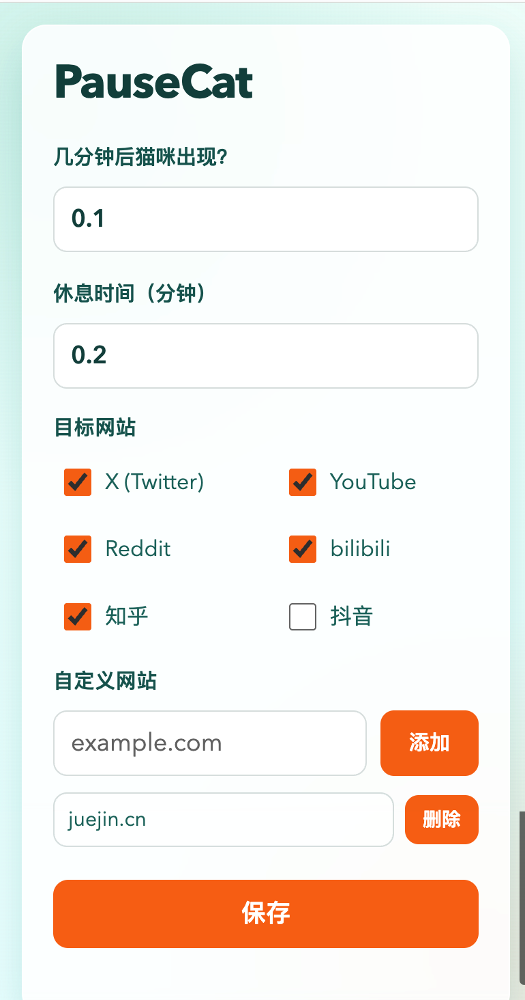

# PauseCat

[中文](./README.zh-CN.md) | [English](./README.en.md)

A Chrome extension that interrupts distracting websites with a full-screen cat after your configured focus duration.

一个 Chrome 扩展：达到设定专注时长后，用全屏猫咪打断分心网站并提醒休息。

## Showcase

### UI Preview

### Demo Video

[▶ Watch Demo Video](./assets/showcase/IMG_0267.mp4)
